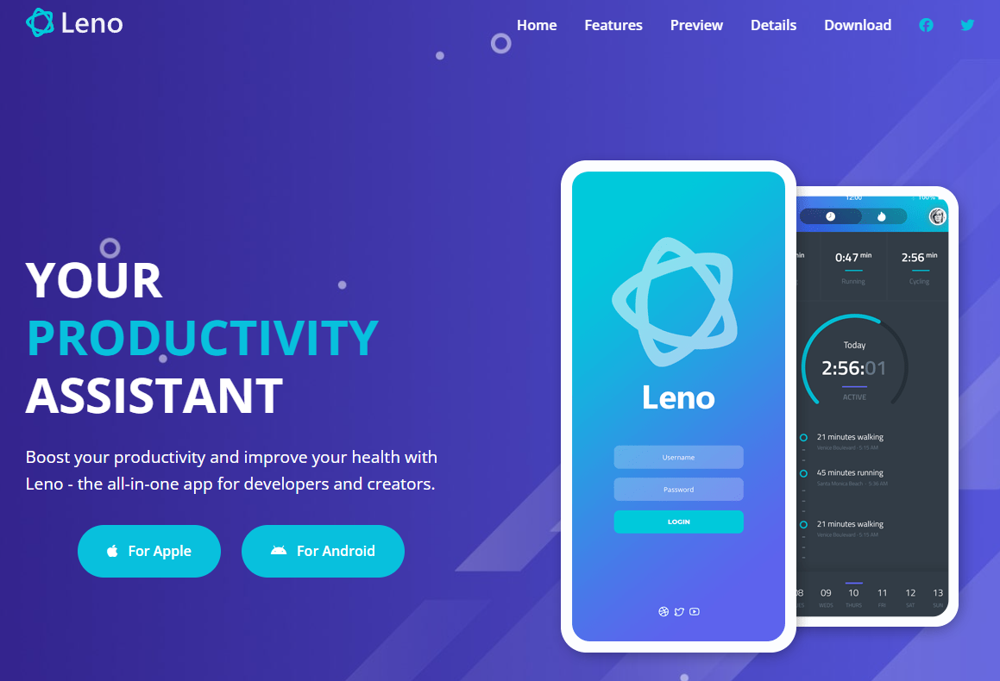
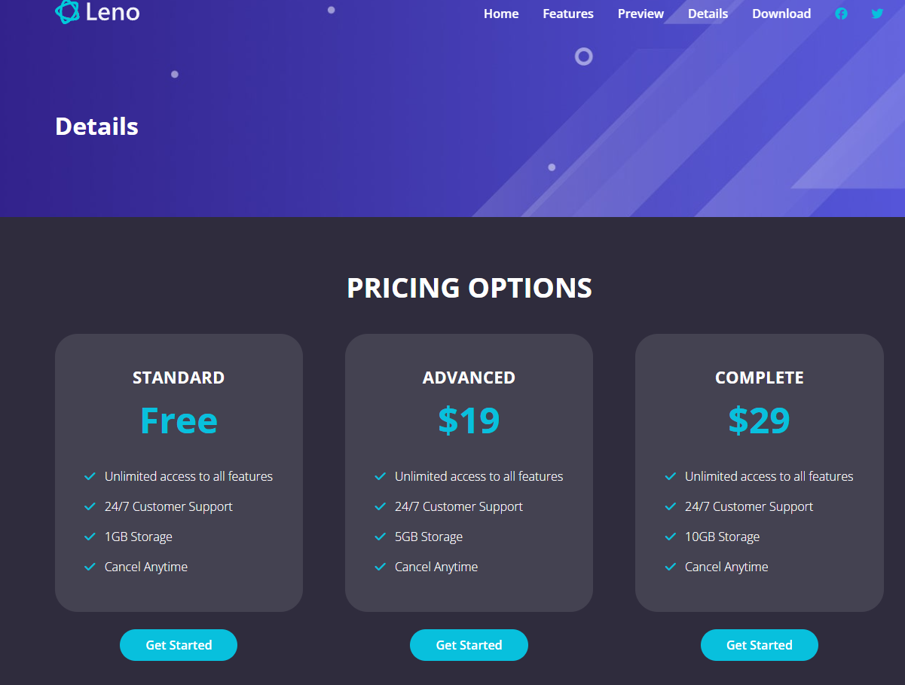
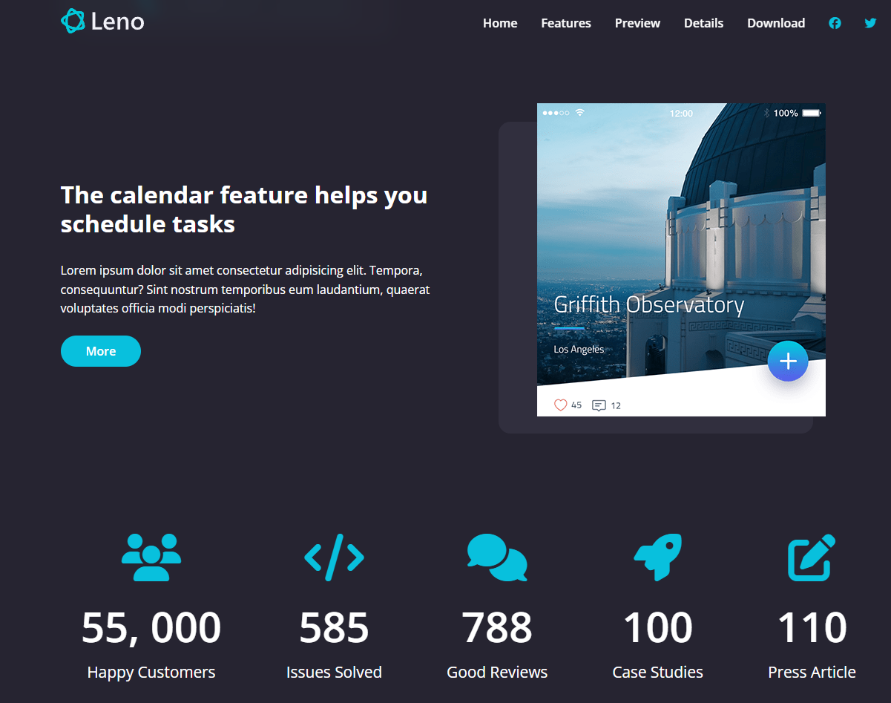
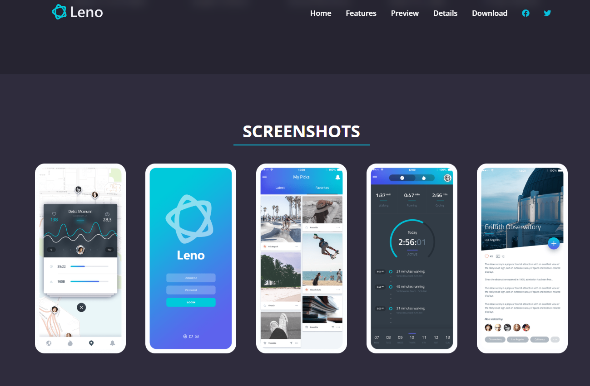
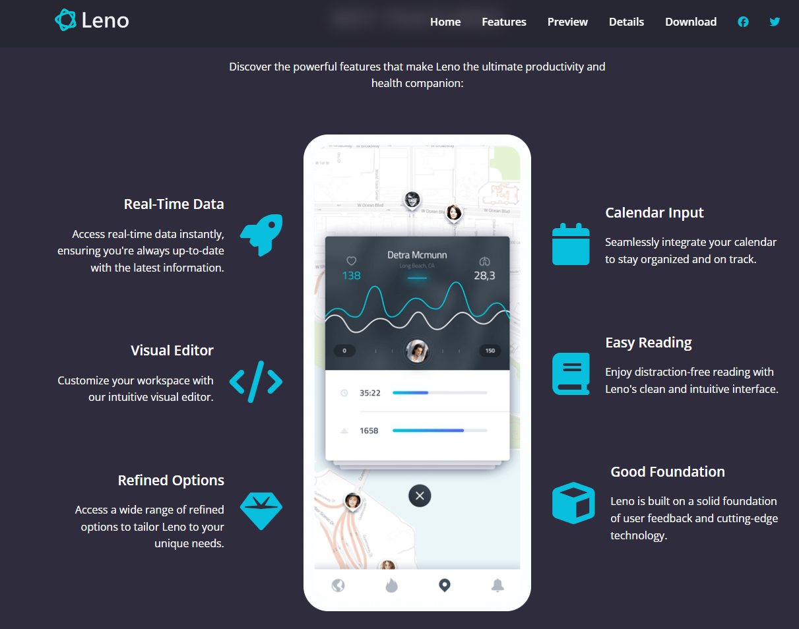

# Leno - App Showcase Website 📱

[**Source Code**](https://github.com/rakibul-efty20/leno-website-css) | [**Live Demo**](https://lenowebsitecss.vercel.app/)

### 📖 Project Overview

A modern, dark-themed landing page designed to promote a mobile application. This was the final capstone project of the course, built to mimic a real-world software product site.

The design features a sleek, "tech-dark" aesthetic with vibrant blue accents, utilizing a complex layout that creates a 3D effect with floating phone mockups. It focuses heavily on user engagement through interactive elements like video modals, tabbed content, and sliding testimonials.

### 🌟 Key Features

* **Sticky Navigation:** A navbar that transitions from transparent to a solid dark background as the user scrolls down.
* **Video Modal:** A custom JavaScript-powered popup window that plays a promotional video when the "Play" button is clicked (includes a backdrop blur effect).
* **Tabbed Features Section:** A specialized interactive area where clicking different tabs (e.g., "Tracking", "Monitoring") dynamically switches the visible content and images without reloading the page.
* **Image Slider:** A horizontal carousel section to showcase app screenshots, allowing users to swipe or click through the app interface.
* **Animated Statistics:** A "Fun Facts" counter that automatically counts up numbers (like "Total Downloads" or "Happy Users") when scrolled into view.
* **Contact Form:** A fully styled HTML5 form with validation states for user inquiries.

### 🛠️ Technologies Used

* **HTML5:** Semantic structure using `<header>`, `<section>`, `<footer>`, and specific distinct blocks.
* **CSS3:**
    * **BEM Methodology:** Strictly followed Block-Element-Modifier naming convention (e.g., `.modal__content`, `.btn--primary`) for clean, scalable code.
    * **CSS Grid & Flexbox:** Used simultaneously—Grid for the overall page layout and features area, Flexbox for alignment within components.
    * **CSS Transitions & Animations:** Smooth hover effects on buttons and the "pulse" animation on the video play button.
* **JavaScript:** Used for the functionality of the Video Modal, the Screenshot Slider, and the Sticky Navigation scroll detection.
* **External Libraries:** FontAwesome for icons and Google Fonts for typography.

### 📚 What I Learned

Building the Leno project solidified advanced front-end concepts:

* **BEM Architecture:** How to structure CSS class names to prevent style conflicts in large projects.
* **JavaScript Integration:** Connecting the DOM to CSS (e.g., toggling the `.modal--open` class) to create interactive overlays.
* **Z-Index Management:** Handling complex layering where floating phone images overlap different background sections.
* **CSS Variables:** Using custom properties for the primary brand colors to easily switch themes.
* **Scroll Events:** Detecting the user's scroll position to trigger navbar changes and animation counters.

### 📷 Screenshots

